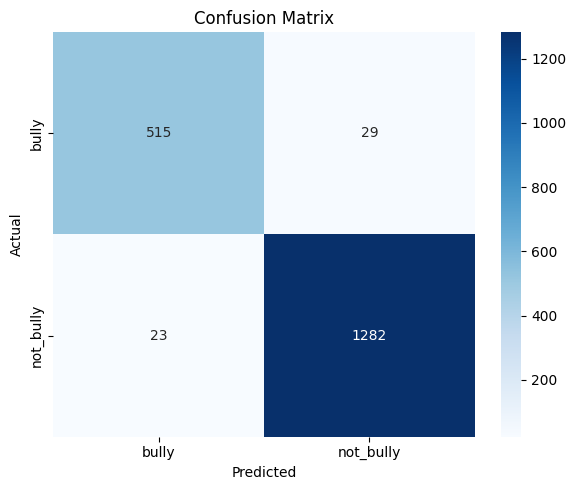

# 🛡️ Cyberbullying Detection System (Bhojpuri Text)

A machine learning-based web application that detects cyberbullying in **Bhojpuri (Devanagari script)** text using **Logistic Regression** and **TF-IDF Vectorization**. Built with Flask and deployed for real-time predictions.

---

## 📘 Detailed Report

### 1. 🧠 Problem Statement

The goal is to build a Cyberbullying Detection model to detect cyberbullying in user-generated text data using Logistic Regression. With the rapid growth of Bhojpuri speakers on social media platforms, cyberbullying has become a serious concern, affecting individuals' mental health and overall well-being. This project aims to identify and classify harmful or offensive content from Bhojpuri text, helping to create a safer and more positive online environment. The model will distinguish between bullying and non-bullying content based on linguistic patterns, enabling early detection and potential intervention.

### 2. 📂 Dataset Overview

We created a curated dataset manually by extracting Bhojpuri text from a variety of online sources including YouTube comments, social media posts, regional blogs, and public forums. The dataset consists of 9241 rows and two main columns:

- **text**: Bhojpuri sentences written in Devanagari script
- **label**: Binary classification — 1 for bully, 0 for not bully

Each data point was carefully reviewed and annotated to ensure labeling accuracy. The text samples represent a diverse set of language expressions, including slang and colloquial terms commonly used in Bhojpuri.

---

## 🚀 Running the Application

1. **Clone the repository**:
    ```bash
    git clone https://github.com/yourusername/cyberguard.git
    cd cyberguard
    ```

2. **Install dependencies**:
    ```bash
    pip install -r requirements.txt
    ```

3. **Train the model** (if not already trained):
    ```bash
    python train_model.py
    ```

4. **Run the Flask application**:
    ```bash
    python app.py
    ```

    The application will be available at [http://127.0.0.1:5000/](http://127.0.0.1:5000/).

---

## 🔧 Features

- **Text Input**: The user enters Bhojpuri text for analysis.
- **Prediction Output**: The system predicts whether the text contains bullying content or not.
- **Confusion Matrix**: Visual representation of the model's performance.
- **TF-IDF Vectorization**: Uses n-grams to capture word relationships and improve prediction accuracy.
- **Logistic Regression**: Trained model to classify bullying text.

---

## 📊 Evaluation Metrics

The model's evaluation is based on standard classification metrics:

- **Precision, Recall, F1-Score**: For detecting bullying content.
- **Confusion Matrix**: Shows the true positive, false positive, true negative, and false negative counts.

---

## 📸 Sample Screenshots

1. **Confusion Matrix**:
   

2. **Classification Report**:
   

3. **ERD (Entity-Relationship Diagram)**:
   

4. **UML Diagram**:
   

5. **System Planning**:
   

---

## 📚 References

- **Dataset**: [Custom Dataset of Bhojpuri Text]
- **Model**: Logistic Regression and TF-IDF Vectorization
- **Libraries**: Flask, scikit-learn, pandas, joblib, matplotlib, seaborn

---

## 🤝 Contribution

Feel free to fork this repository and contribute by submitting pull requests. Issues and feature requests are always welcome!

---

## 📧 Contact

If you have any questions or suggestions, feel free to reach out via [priteshk105@gmail.com].
